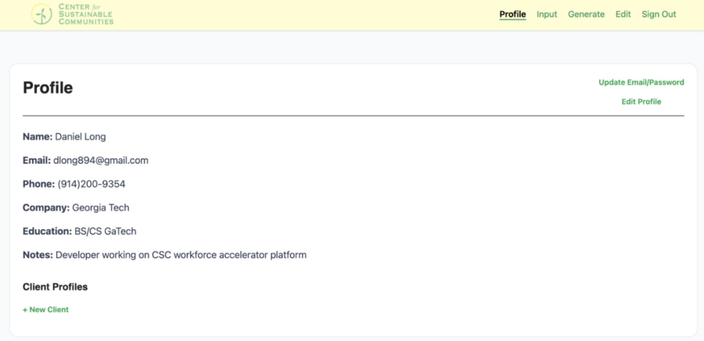
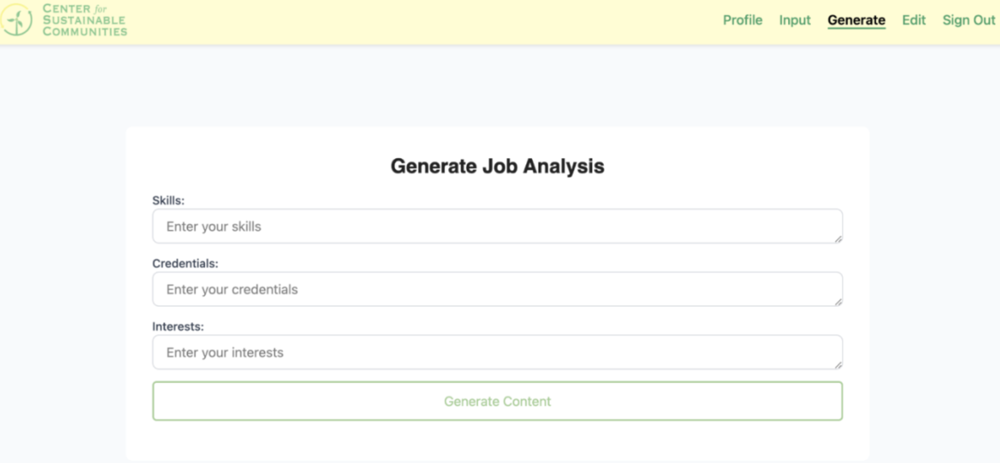
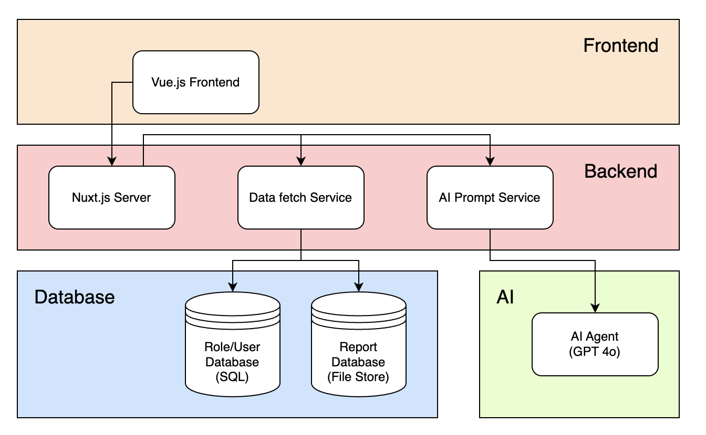
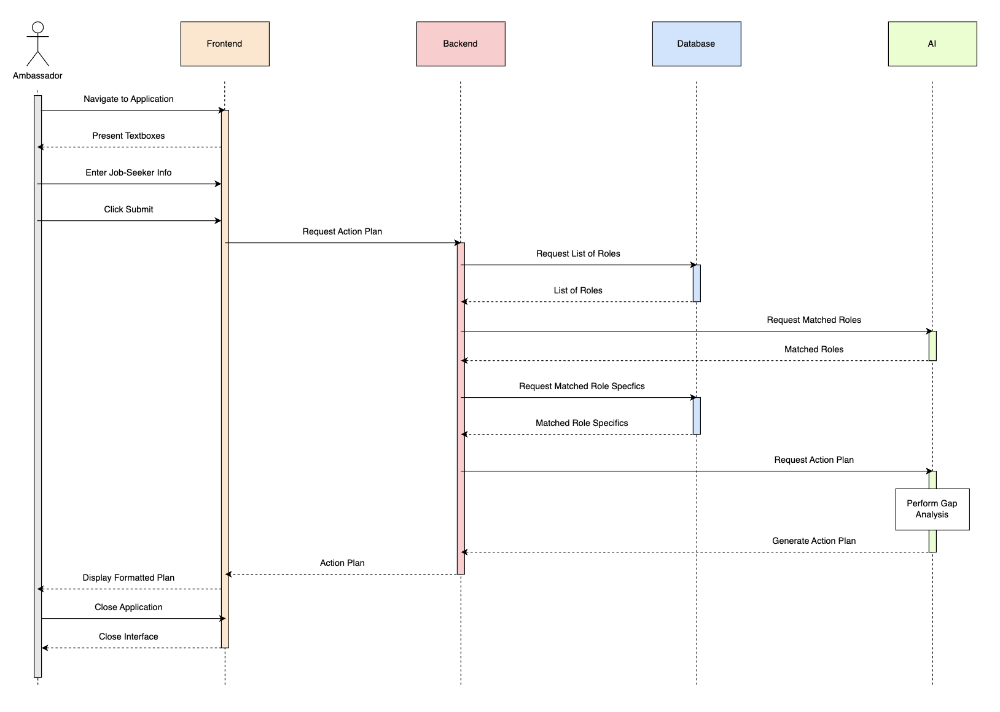

# CSC Workforce Accelerator Platform

Full-stack workforce management platform with **AI-powered skill gap analysis** built for the **Center of Sustainable Communities**.

The system enables program ambassadors to manage job-seeker profiles, analyze workforce skill gaps, and securely manage program documents through a centralized digital platform.

This project was developed as part of a **client-facing software engineering capstone project**, delivering a production-ready application used for real workforce development programs.

---

# Demo

Full system walkthrough

▶️ **Demo Video**  
Coming soon – video walkthrough of the full application workflow including profile management and AI skill gap analysis.

---

# Overview

The CSC Workforce Accelerator platform digitizes workforce development workflows that were previously managed manually, enabling scalable data-driven workforce program management.

It enables program ambassadors to:

- Manage job-seeker profiles and program participation
- Analyze workforce skill gaps using AI
- Securely store and retrieve program documents
- Track workforce development outcomes

The system improves **program efficiency, data accessibility, and decision-making** for workforce initiatives.

---

# Key Features

## Ambassador Dashboard

Centralized dashboard for workforce program management.

Capabilities include:

- Create and update job-seeker profiles
- Track workforce program participation
- Monitor program metrics and insights
- Manage candidate progress through workforce pipelines

---

## AI-Powered Skill Gap Analysis

The platform includes an **AI-assisted workflow** that evaluates candidate profiles and identifies skill gaps relative to job requirements.

This allows ambassadors to:

- Identify missing qualifications
- Recommend targeted training programs
- Improve job placement outcomes

---

## Secure Document Management

The system integrates with cloud storage services to manage sensitive workforce documents.

Security features include:

- OAuth 2.0 authentication
- TLS encrypted communication
- Role-based access permissions

Documents are securely stored and retrieved through integrated cloud APIs.

---

# System Architecture

The platform follows a modular architecture separating:

- Frontend UI components
- Backend data services
- Database storage
- AI analysis pipeline

The architecture separates frontend presentation, backend services, database storage, and AI-powered analysis components to support scalable workforce data processing.

---

# System Workflow

The system processes workforce data through multiple stages including profile ingestion, AI skill analysis, and program tracking.

---

# Tech Stack

### Frontend
- Vue.js
- Nuxt.js
- JavaScript
- HTML / CSS

### Backend & Data
- Firebase
- Firestore
- Google Cloud APIs

### AI / ML
- LLM-based analysis pipeline
- Retrieval-Augmented workflows

### Security
- OAuth 2.0
- TLS encrypted communication

---

# My Contributions

As a **Software Engineer on the project team**, I contributed to the design and implementation of core platform features.

Key contributions include:

- Developed frontend modules using **Vue.js / Nuxt.js** for ambassador workflows
- Integrated **Firebase Firestore** for workforce data management
- Implemented backend data flows for profile creation, updates, and retrieval
- Built components supporting **AI-assisted skill gap analysis workflows**
- Designed scalable data models for workforce program records
- Collaborated with a cross-functional engineering team to deliver the platform for a real client

---

# Project Context

This system was built for the **Center of Sustainable Communities** as part of a client-facing software engineering project.

The objective was to build a scalable digital platform that supports workforce development programs and improves data-driven decision making.

---

# Repository Notes

This repository serves as a **project showcase** highlighting system architecture, system features, and engineering contributions.

Some implementation details and datasets have been omitted due to project confidentiality.
